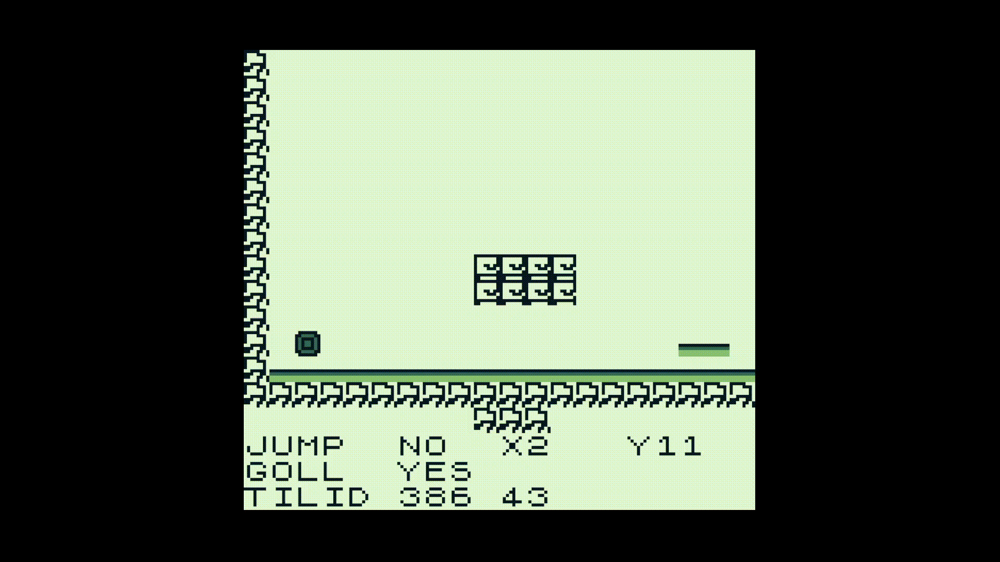

# The Shapes

A game where you have a different abilities by different shapes.
 Using those abilities you should solve a puzzle and proceed to the exit of each level.

## Concept ideas
Abilities:
- 🔺 The Triangle can use booster and guide lines.
- 🟦 The Square can jump and press buttons.
- 🟣 The Circle has antigravitation and can collect tokens.

🔳 An exit for the level

You can switch between abilities to solve the level.

## Levels
### L1
The first level showcase the abilities of the Square. You can press buttons and jump over a platform to finish the level.
### L2
This level is about Triangle abilities. Use guide lines to exit the level.
### L3
Circle abilities. You should collect a token to activate guide line and change to Circle to exit the level.
### L4 broken state
All three shapes are placed into the different corners of the level.
 You need to switch between them to help each other to open the path and then unite back into single player.
